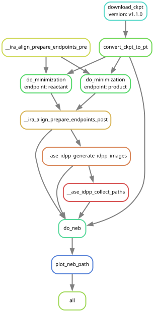
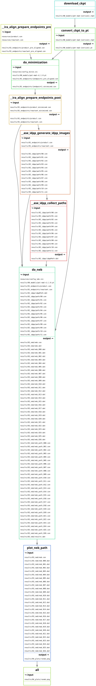
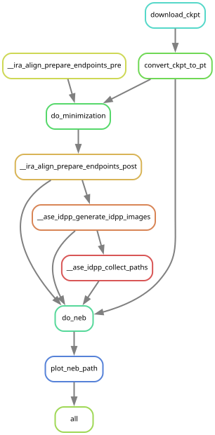

* About
This Snakemake workflow runs the NEB systems and regenerates the blog figures.

The automated steps are:
- export PET-MAD
- prepare and minimize endpoints
- run energy-weighted OCI-NEB in eOn
- write readcon v2 =.con= trajectories
- generate 1D profiles, 2D RMSD landscapes, and diagnostic plots

#+caption: DAG for the workflow

** Setup
Use the root =pixi.toml=:

#+begin_src bash
pixi shell -e cpu
#+end_src

** Usage
Run the complete workflow from the repository root:

#+begin_src bash
pixi run -e cpu all
#+end_src

Run only the figure targets from existing eOn results:

#+begin_src bash
pixi run -e cpu figures
#+end_src

Inspect the plan:

#+begin_src bash
pixi run -e cpu dry-run
#+end_src

The figure outputs live in:

#+begin_src text
results/03_figures/blog
#+end_src

** Direct plotting
For a single landscape after the NEB files exist:

#+begin_src bash
cd results/02_neb/system_100
python -m rgpycrumbs.cli eon plt-neb \
    --con-file neb.con \
    --plot-type landscape \
    --project-path \
    --show-pts \
    --landscape-path all \
    --plot-structures crit_points \
    --surface-type grad_imq \
    --input-dat-pattern "neb_*.dat" \
    --input-path-pattern "neb_path*.con" \
    --ira-kmax 14 \
    --show-legend
#+end_src

** More visual aids
Regenerate the Snakemake graphs via:

#+begin_src bash
pixi run all-graphs
#+end_src

*** Filegraph

*** Rulegraph

** References
1. R. Goswami, G. Fraux, S. R. Cox, and C. Corminboeuf,
   "Two-dimensional RMSD projections for reaction path visualization and
   validation," MethodsX 2026. doi:10.1016/j.mex.2026.103851.
2. R. Goswami, G. Fraux, and C. Corminboeuf, "Enhanced climbing image nudged
   elastic band method with Hessian eigenmode alignment," Frontiers in
   Chemistry 2026. doi:10.3389/fchem.2026.1807063.
3. R. Goswami, G. Fraux, and C. Corminboeuf, "Reproducible orchestration of
   best practices for reaction path optimization with the nudged elastic band,"
   MethodsX 2026. doi:10.1016/j.mex.2026.103899.
